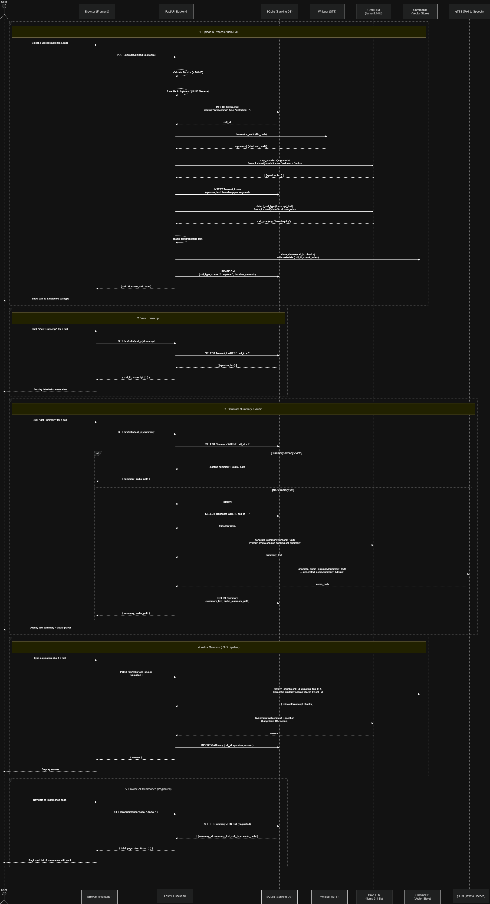
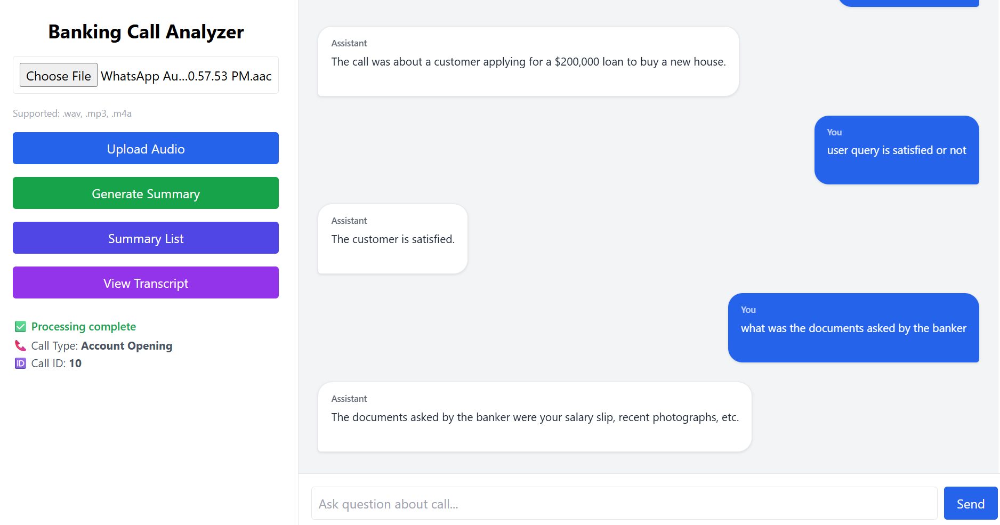
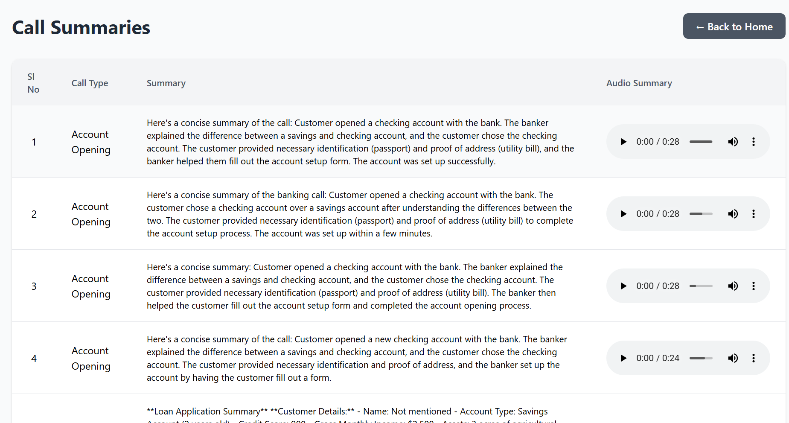

# AI-Powered Banking Call Analyzer

## Problem Statement

Customer support and banking call centers generate thousands of audio conversations daily. Manually reviewing these calls for quality monitoring, compliance checks, issue resolution, and customer insights is time-consuming and inefficient.

The goal of this project is to build an AI-powered system that automatically:

* Transcribes uploaded banking call recordings.
* Identifies speakers in the conversation.
* Detects the call category automatically.
* Generates concise call summaries.
* Produces audio summaries.
* Enables natural language Question Answering over call transcripts using Retrieval-Augmented Generation (RAG).

This helps organizations reduce manual effort and quickly extract meaningful insights from customer interactions.

---

# Project Overview

The Banking Call Analyzer is a FastAPI-based AI application that processes customer support call recordings end-to-end.

The system:

1. Accepts audio call recordings.
2. Converts speech into text using Whisper.
3. Performs speaker mapping.
4. Stores transcripts in SQLite.
5. Chunks transcripts and stores embeddings in ChromaDB.
6. Uses LLMs through Groq for:

   * Call type detection
   * Summary generation
   * Question answering
7. Generates audio summaries using Text-to-Speech.
8. Provides a web interface for interacting with processed calls.

---

# Workflow

```text
Audio Upload
      │
      ▼
Save Audio File
      │
      ▼
Whisper Transcription
      │
      ▼
Speaker Mapping
      │
      ▼
Store Transcript
      │
      ▼
Generate Call Type
      │
      ▼
Chunk Transcript
      │
      ▼
Generate Embeddings
      │
      ▼
Store in ChromaDB
      │
      ▼
Generate Summary
      │
      ▼
Generate Audio Summary
      │
      ▼
Question Answering via RAG
```

---

# LangChain Flow

The project uses LangChain primarily for orchestration of the RAG pipeline.

```text
User Question
      │
      ▼
LangChain Chain
      │
      ▼
Chroma Retriever
      │
      ▼
Retrieve Relevant Chunks
      │
      ▼
Prompt Construction
      │
      ▼
Groq LLM
      │
      ▼
Final Answer
```

---

# Folder Structure

```text
call_analyser/
│
├── app/
│   ├── api/
│   │   └── routes/
│   │       ├── upload.py
│   │       ├── transcript.py
│   │       ├── summary.py
│   │       ├── summary_list.py
│   │       └── qa.py
│   │
│   ├── core/
│   │   ├── config.py
│   │   └── database.py
│   │
│   ├── models/
│   │   ├── call.py
│   │   ├── transcript.py
│   │   ├── summary.py
│   │   └── qa.py
│   │
│   ├── schemas/
│   │
│   ├── services/
│   │   ├── whisper_service.py
│   │   ├── speaker_service.py
│   │   ├── summary_service.py
│   │   ├── chroma_service.py
│   │   ├── embedding_service.py
│   │   ├── rag_service.py
│   │   ├── groq_service.py
│   │   └── tts_service.py
│   │
│   └── utils/
│       ├── chunking.py
│       └── file_utils.py
│
├── chroma_db/
├── uploads/
├── generated_audio/
├── templates/
│       ├── index.html
│       └── summaries.html
├── static/
│       ├── app.js
│       └── summaries.js
├── banking_calls.db
├── pyproject.toml
└── README.md
```

---


---

# Sequence Diagram



---

# API Endpoints

## 1. Upload Call

### POST `/api/calls/upload`

Uploads and processes an audio recording.

**Response**

```json
{
  "call_id": 1,
  "status": "completed",
  "message": "Call processed successfully",
  "call_type": "Loan Inquiry"
}
```

---

## 2. Get Transcript

### GET `/api/calls/{call_id}/transcript`

Returns transcript with speaker labels.

**Response**

```json
{
  "call_id": 1,
  "transcript": [
    {
      "speaker": "Agent",
      "text": "Hello, how may I help you?"
    }
  ]
}
```

---

## 3. Generate/Get Summary

### GET `/api/calls/{call_id}/summary`

Returns generated summary and audio summary path.

**Response**

```json
{
  "call_id": 1,
  "summary": "...",
  "audio_path": "/generated_audio/summary_1.mp3"
}
```

---

## 4. Ask Questions (RAG)

### POST `/api/calls/{call_id}/ask`

**Request**

```json
{
  "question": "What issue did the customer report?"
}
```

**Response**

```json
{
  "answer": "The customer reported issues with internet banking login."
}
```

---

## 5. List Summaries

### GET `/api/summaries`

Supports pagination.

**Parameters**

```text
page
size
```

**Response**

```json
{
  "total": 25,
  "page": 1,
  "size": 10,
  "items": []
}
```

---

# Models Used

## Speech-to-Text

### OpenAI Whisper

Used for:

* Audio transcription
* Timestamp extraction

---

## Embedding Model

### Sentence Transformer Embeddings

Used for:

* Transcript chunk embeddings
* Semantic retrieval

---

## Large Language Model

### Groq LLM

Used for:

* Call type detection
* Summary generation
* Question answering

---

## Vector Database

### ChromaDB

Used for:

* Storing embeddings
* Similarity search
* Retrieval for RAG

---

## Text-to-Speech

Used for:

* Audio summary generation

---

# Database Schema

## Call

```text
call_id
file_name
call_type
audio_path
duration_seconds
processing_status
```

## Transcript

```text
transcript_id
call_id
speaker
text
timestamp
```

## Summary

```text
summary_id
call_id
summary_text
audio_summary_path
```

## QA History

```text
qa_id
call_id
question
answer
```

---

# Tech Stack

## Backend

* FastAPI
* Python 3.11
* SQLAlchemy

## Database

* SQLite

## AI/ML

* Whisper
* LangChain
* Groq
* ChromaDB
* Sentence Transformers

## Frontend

* HTML
* CSS
* JavaScript

## Storage

* Local File System
* Chroma Vector Store

---

# Installation

```bash
git clone <repository_url>

cd call_analyser

uv sync

uv run uvicorn app.main:app --reload
```

Application URL:

```text
http://localhost:8000
```

---

# Screenshots

## Home Page





## Summary List




---
---

